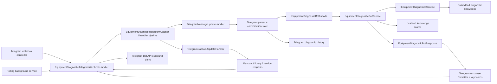

# ED-24BOT.AUDIT1 Bot Architecture Audit

## Current flow

The production flow has two Telegram transport entry points and one shared handler:

Webhook mode enters through `EquipmentDiagnosticsTelegramWebhookController.Receive`; polling mode enters through
`EquipmentDiagnosticTelegramPollingBackgroundService.PollOnceAsync`. Both call
`EquipmentDiagnosticTelegramWebhookHandler`, which validates or trusts the transport, maps Telegram DTOs to
`EquipmentDiagnosticTelegramUpdate`, delegates to the adapter, and sends or edits Telegram messages/documents.

The adapter pipeline applies the blocked-user guard, callback routing, and message routing. For diagnostic text,
`EquipmentDiagnosticTelegramMessageParser` mixes Telegram commands with extraction of manufacturer, code, series,
equipment side, and display context. `TelegramDiagnosticConversationService` then performs a second candidate
search and owns multi-step brand/equipment/display/series clarification. The final structured request is sent to
`IEquipmentDiagnosticBotFacade`, whose `EquipmentDiagnosticBotService` performs deterministic lookup, ambiguity
resolution, alias handling, localized knowledge selection, safety classification, and semantic response creation.

The response is not fully self-contained for presentation: `EquipmentDiagnosticTelegramResponseFormatter`
queries `IErrorKnowledgeLocalizationSource` again and chooses Consumer/Installer/Engineer text. The conversation
service records completed/not-found cases before Telegram formatting, then the formatter and conversation service
add Telegram text, HTML, chunking, and keyboards.

The repository already has partial web reuse. `EquipmentDiagnosticsController` exposes catalog search, case lookup,
and `POST /api/v1/equipment-diagnostics/bot/diagnose`. The latter calls the same bot facade, but its public contract
is bot-named, requires already structured input, and does not carry every semantic field needed by a future web UI.

## Current key files/classes

| File / class | Current role | Boundary |
| --- | --- | --- |
| `EquipmentDiagnosticsTelegramWebhookController` | HTTP Telegram webhook entry point | Telegram-specific |
| `EquipmentDiagnosticTelegramPollingBackgroundService` | Long-polling, offsets, deduplication | Telegram-specific |
| `EquipmentDiagnosticTelegramWebhookHandler` | Telegram DTO mapping, callback answers, sends/edits/documents | Telegram-specific |
| `EquipmentDiagnosticTelegramAdapter` / `TelegramUpdateHandlerPipeline` | Orders update guards and handlers | Telegram-specific |
| `TelegramMessageUpdateHandler` | Access, commands, dialogs, diagnostics, formatting dispatch | Mixed orchestration |
| `TelegramCallbackUpdateHandler` | Callback-prefix routing and edit/suppress semantics | Telegram-specific |
| `EquipmentDiagnosticTelegramMessageParser` | Telegram commands plus raw diagnostic text parsing | Mixed |
| `TelegramDiagnosticConversationService` | Candidate lookup, clarification state, history, formatting, keyboards | Strongly mixed |
| `EquipmentDiagnosticTelegramResponseFormatter` | Audience localization plus Telegram/plain/HTML rendering | Strongly mixed |
| `EquipmentDiagnosticTelegramContracts` | Updates, outbound messages, markup, callback response | Telegram-specific |
| `EquipmentDiagnosticBotRequestPolicy` | Structured input validation and trimming | Channel-neutral candidate |
| `DiagnosticRoutingHintExtractor` | Series hints and series matching | Channel-neutral candidate |
| `DiagnosticCandidateResolver` | Deterministic match/ambiguity resolution | Channel-neutral |
| `EquipmentDiagnosticBotService` | Lookup, aliases, ambiguity, semantic cards, warnings | Mostly channel-neutral |
| `EquipmentDiagnosticBotContracts` | Structured request/result/identity/cards | Mostly channel-neutral, public compatibility risk |
| `IEquipmentDiagnosticsService` / `InMemoryEquipmentDiagnosticsService` | Catalog search and case materialization | Channel-neutral |
| `IEquipmentDiagnosticsKnowledgeSource` and localization source | Embedded runtime knowledge and localized guidance | Channel-neutral |
| `IEquipmentDiagnosticsFacade` / `IEquipmentDiagnosticBotFacade` | Public module boundaries used by API and Telegram | Channel-neutral |
| `TelegramDiagnosticHistoryService` and stores | `/history`, `/last`, Telegram user/session projection | Telegram-specific persistence |
| `TelegramManualLibraryService` and binding stores | Registry resolution, access, callbacks, `file_id` delivery | Telegram-specific |
| Service-request services and stores | Telegram queue, dialogs, callbacks, notifications | Telegram-specific |

The largest change-risk hotspots are `TelegramManualLibraryService` (about 3,000 lines),
`TelegramDiagnosticConversationService` (about 1,800), `EquipmentDiagnosticBotService` (about 800),
`EquipmentDiagnosticTelegramResponseFormatter` (about 800), and `TelegramMessageUpdateHandler` (about 700).

## Channel-neutral candidates

The following behavior is already reusable or close to reusable:

- structured request validation in `EquipmentDiagnosticBotRequestPolicy`;
- series recognition/matching in `DiagnosticRoutingHintExtractor`;
- deterministic ambiguity resolution in `DiagnosticCandidateResolver`;
- knowledge lookup in `IEquipmentDiagnosticsService`;
- normalized manufacturer/code, matched equipment context, observed/canonical code, confidence, warnings, and next
  steps in `EquipmentDiagnosticBotResponse`;
- source and safety cards produced by `EquipmentDiagnosticBotService`;
- catalog/case DTOs, including diagnostic steps, measurements, source evidence, confidence, applicability, safety,
  and manual references;
- knowledge/localization entries containing signal type, severity, equipment identity, source references, and
  audience-specific guidance.

The future web result can be built without Telegram dependencies, but the present bot response needs completion:

- localized title, summary, causes, checks, do-not-advise, and recommended action are re-selected by the Telegram
  formatter instead of being carried as a self-contained semantic result;
- localized `SignalType` and `Severity` exist in knowledge but are not first-class bot response fields;
- manual source references exist in knowledge/case DTOs, while the bot response exposes only a limited source card;
- ambiguity information exists, but clarification labels and follow-up prompts are presentation strings;
- `InternalDecisionTrace` is useful for tests/operations but should not become a public web guarantee;
- raw text normalization is Telegram-owned, while the HTTP endpoint accepts only structured fields.

## Telegram adapter boundaries

Keep the following in the Telegram adapter:

- webhook/polling DTOs, security, offsets, deduplication, counters, and Bot API clients;
- `/start`, `/help`, `/last`, `/history`, admin, library, request, and queue command recognition;
- chat/user access, role-to-audience mapping, contact sharing, sessions, callback prefixes, and callback answers;
- reply/inline keyboards, `parse_mode`, HTML escaping, message chunking, previews, edits, and group-safe markup;
- Telegram-safe fallback messages and outbound retry/error handling;
- Telegram `file_id`, protected document delivery, and upload/binding workflows.

The adapter should eventually translate raw Telegram text into a neutral diagnostic request and translate a
neutral result into Telegram messages. It should not remain the owner of catalog candidate selection, alias
canonicalization, or matched diagnostic identity.

## Manual/library/service-request boundaries

Do not include manual-library extraction in CORE1. The current service combines:

- the accepted Telegram library access policy;
- Telegram user roles and grants;
- last Telegram diagnostic lookup;
- manual registry/source-reference reconciliation;
- binding activity/visibility rules;
- callback navigation and pagination;
- Telegram `file_id` upload and protected delivery.

A future neutral core may return stable manual reference identifiers and applicability metadata. Resolving those
references to Telegram `file_id`, enforcing library browsing grants, and sending files must remain Telegram-side.

Do not include service requests in CORE1. Requests are keyed to Telegram users and diagnostic-case persistence and
include group cards, assignments, private contact rules, callbacks, message edits, dialog attachments, and audit
events. Moving them would broaden the extraction from diagnostics into workflow redesign.

## Existing test coverage

Current protection is substantial:

- `EquipmentDiagnosticBotServiceTests` cover exact match, ambiguity, not-found, reference-only codes, controller
  names, manual-backed fallback, meaning groups, aliases, GMV family routing, and safe output.
- `EquipmentDiagnosticBotScenarioAcceptanceTests` provide deterministic scenario-pack coverage.
- `EquipmentDiagnosticBotRequestPolicyTests` cover structured validation, limits, trimming, measurements, and
  control characters.
- `EquipmentDiagnosticBotApiIntegrationTests` protect the existing HTTP bot route, response statuses, validation,
  safe output, façade dependency, and contract examples.
- `EquipmentDiagnosticTelegramParserTests` protect Telegram text/code/hint parsing.
- `EquipmentDiagnosticTelegramAdapterTests` protect command handling, access, series/casing/alias behavior,
  ambiguity, formatting, `/last`, and unsafe-text exclusions.
- `EquipmentDiagnosticTelegramConversationStateMachineTests` protect clarification flow, persisted sessions,
  completed/not-found history, matched series preservation, legacy history fallback, and role-specific `/last`.
- `EquipmentDiagnosticTelegramFormatterTests` protect Russian Consumer/Installer/Engineer output, HTML escaping,
  compact Gree formatting, status/reference semantics, and output stage contracts.
- webhook and polling tests protect security, DTO mapping, callback acknowledgement, edits, documents,
  deduplication, offsets, and safe failure behavior.
- manual-library and service-request suites protect access policy, diagnostic manuals, `file_id` delivery, callback
  navigation, queue lifecycle, privacy, and failure fallbacks.

## Missing tests before CORE1

Add characterization tests before moving logic:

1. A semantic result snapshot/matrix for Answer, ClarificationRequired, ReferenceOnly, NotFound, and Unsupported,
   asserting identity, canonical/observed code, signal type, severity, confidence, ambiguity, warnings, localized
   guidance, sources, and manual reference IDs.
2. Explicit parity between the existing bot façade/API response and the proposed neutral core for the same
   structured request. Existing public JSON names/statuses must remain stable.
3. Standalone `DiagnosticCandidateResolver` tests for brand, series, equipment group, display surface, meaning
   group, and deterministic ordering.
4. Normalization parity tests for structured web input and Telegram-derived input: whitespace, case-sensitive
   codes such as `o1`, `01`, `D1`, and `d1`, `HO`/`H0`, model hints, U-Match model text, and all supported Gree
   series labels.
5. A test proving the neutral core assembly/namespace has no references to
   `Application.Telegram`, Telegram user roles, callback data, reply markup, or `file_id`.
6. History projection tests that map a neutral completed/not-found result to the existing Telegram record while
   retaining backward-compatible `/last` behavior for old `NormalizedRequestJson`.
7. A parity test proving Consumer/Installer/Engineer Telegram rendering is unchanged when fed through the
   compatibility adapter.
8. A characterization test for the fallback diagnostic path in `TelegramMessageUpdateHandler`, confirming whether
   it is reachable and whether history is recorded. Do not silently remove it during extraction.

## Production risks

1. **Duplicated orchestration.** `TelegramDiagnosticConversationService` searches and narrows candidates before
   `EquipmentDiagnosticBotService` searches/resolves again. Routing, alias, casing, and series rules can drift.
2. **Non-self-contained result.** The Telegram formatter queries localization again. A web caller receiving the bot
   response may not receive the same audience guidance Telegram displays.
3. **Public compatibility.** `/equipment-diagnostics/bot/diagnose` already exposes
   `EquipmentDiagnosticBotRequest/Response`; renaming or reshaping them is an API break.
4. **History coupling and loss.** Telegram history is keyed to Telegram user/session/role, stores a shortened summary,
   and hides matched series in JSON. It is not a neutral history model.
5. **Manual coupling.** Diagnostic manuals are resolved from the latest Telegram history record and delivered by
   Telegram `file_id`; moving this into core risks access and document-selection regressions.
6. **Large mixed classes.** Conversation, manual, formatter, and message-handler classes make broad edits hard to
   review and increase accidental behavior changes.
7. **Dual knowledge paths.** Runtime catalog entries and localized V2 entries follow partially different mapping
   paths. Extraction must preserve priority, meaning-group, GMV-family, and reference-only behavior.
8. **Audience semantics.** Telegram roles currently select localized audiences. A neutral contract must model
   audience explicitly without importing Telegram roles.
9. **Operational regressions.** Callback acknowledgement, message edits, polling offset movement, deduplication, and
   safe outbound fallback are transport invariants and must remain untouched.

## Recommended CORE1 slice

Use a compatibility-first slice; do not rename existing public bot contracts or routes.

### Classes/interfaces to create

- `Application/Diagnostics/DiagnosticCoreRequest.cs`
- `Application/Diagnostics/DiagnosticCoreResult.cs`
- `Application/Diagnostics/DiagnosticMatchIdentity.cs`
- `Application/Diagnostics/DiagnosticLocalizedGuidance.cs`
- `Application/Diagnostics/DiagnosticAmbiguity.cs`
- `Application/Diagnostics/DiagnosticSourceReference.cs`
- `Application/Diagnostics/IEquipmentDiagnosticCore.cs`
- `Application/Diagnostics/EquipmentDiagnosticCore.cs`
- `Application/Bot/EquipmentDiagnosticBotCompatibilityMapper.cs`

The neutral result should carry:

- normalized request and observed/canonical code;
- matched manufacturer, series, model, category, equipment side, and display context;
- resolution status and ambiguity candidates;
- signal type, severity, confidence, verification flags, and applicability contexts;
- locale/audience guidance using a neutral audience enum, not `TelegramUserRole`;
- warnings, next steps, safety boundary, and source/manual reference identifiers.

### Files to change

- move semantic lookup/resolution from `EquipmentDiagnosticBotService` behind `IEquipmentDiagnosticCore`;
- keep `EquipmentDiagnosticBotService` and `IEquipmentDiagnosticBotFacade` as compatibility adapters so the
  existing HTTP route and Telegram callers remain byte-for-byte contract compatible;
- register the neutral core in `EquipmentDiagnosticsModuleServiceCollectionExtensions`;
- add focused core, compatibility-parity, architecture-boundary, and Telegram-rendering parity tests.

### Files not to change in the first slice

- all files under `Application/Telegram`;
- Telegram persistence entities/stores and EF migrations;
- `EquipmentDiagnosticsController` routes and public bot JSON contracts;
- diagnostic JSON and manual registry/files;
- manual-library, service-request, deployment, and configuration code.

### Smoke cases

- `Gree H5` exact runtime answer;
- `Gree U-Match GUD71PH1/B-S E9` matched as `Gree U-Match R32 E9`;
- `Gree GMV Mini C0` and `Gree GMV9 Flex C0` retain distinct identity;
- unqualified `C0` and `n2` retain deterministic ambiguity;
- GMV6 `U0` remains reference/debug knowledge, not a fault;
- `HO` maps to canonical `H0`;
- `o1`, `01`, `D1`, and `d1` retain current casing/confusable behavior;
- unknown code remains safe NotFound;
- existing Consumer/Installer/Engineer Telegram output and `/last` remain unchanged.

Only after this compatibility slice passes should a later stage make
`EquipmentDiagnosticTelegramMessageParser` delegate diagnostic text interpretation to a neutral interpreter or
make Telegram history project from a neutral history event.

## Out of scope

- **MANUAL1:** manual registry redesign, file bindings, library access, and Telegram document delivery.
- **REQUEST1:** service-request lifecycle, queue, dialogs, assignments, contact sharing, and audit events.
- **WEB1:** new web UI, new public API routes, or changes to current API contracts.
- Telegram behavior changes, diagnostic knowledge edits, migrations, deployment/configuration changes, and the
  implementation of CORE1 itself.

AUDIT1 ends with this report. CORE1 must not begin until the report is reviewed.
